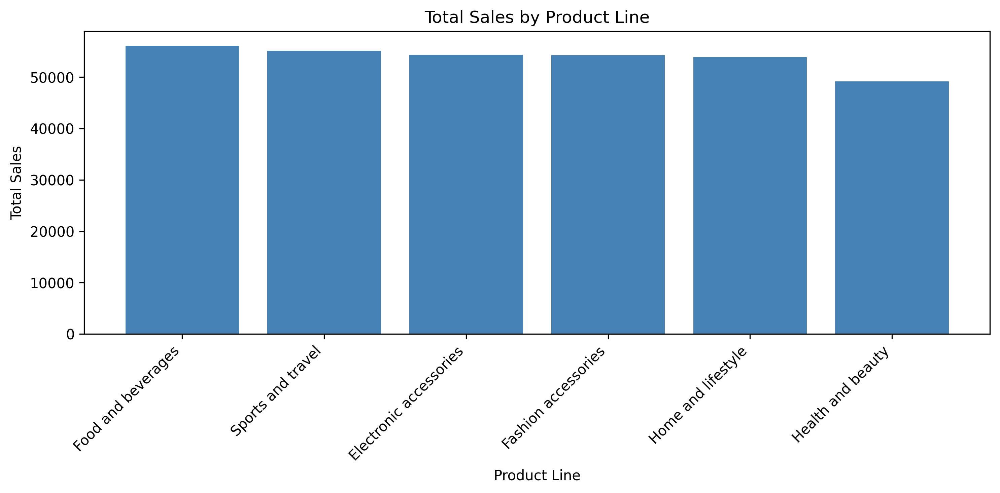
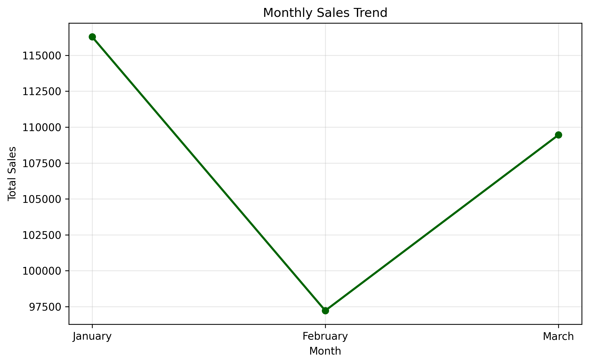
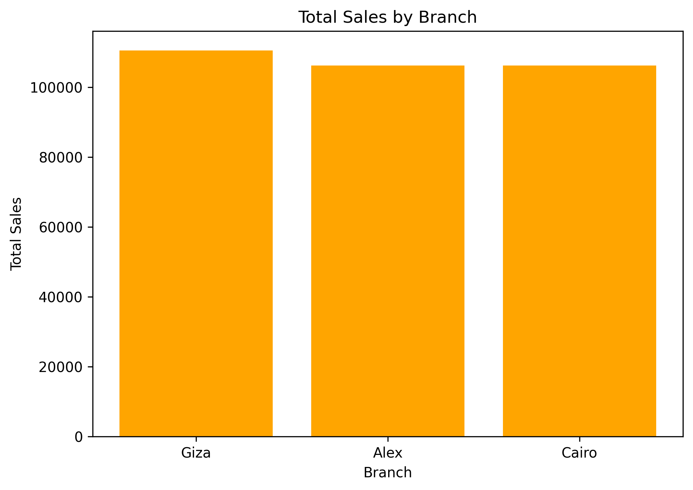

# Supermarket Sales Analysis

## Project Overview

This project analyzes supermarket transaction data to understand sales performance across product lines, branches, customer types, payment methods, and time periods.

The project includes data cleaning, transformation, validation, analysis, visualization, and export using Python.

## Tools Used

- Python
- pandas
- NumPy
- Matplotlib
- Jupyter Notebook

## Dataset

The dataset contains 1,000 supermarket transactions and 17 original columns, including:

- Invoice ID
- Branch and city
- Customer type and gender
- Product line
- Unit price and quantity
- Tax and total sales
- Date and time
- Payment method
- Gross income and rating

## Data Cleaning

The following cleaning tasks were performed:

- Standardized column names
- Renamed financial columns
- Checked missing values
- Checked duplicate records
- Cleaned text columns
- Converted dates and times
- Validated quantity and rating ranges
- Checked for negative financial values
- Verified the total-sales calculation

## Data Transformation

The following columns were created:

- Year
- Month number
- Month name
- Day name

Summary tables were created for:

- Product-line performance
- Branch performance
- Customer types
- Gender and customer type
- Payment methods
- Monthly sales
- Daily sales
- Best-selling product line by branch

## Key Insights

- Food and beverages generated the highest total sales.
- Electronic accessories had the highest quantity sold.
- Sales performance was compared across all branches.
- Payment methods were compared using sales and transaction counts.
- Monthly and daily sales trends were identified.
- The highest-performing product line was identified for every branch.

## Visualizations

### Product-line sales



### Monthly sales trend



### Branch sales



## Project Files

- `Supermarket_Sales_Analysis.ipynb` — complete Python analysis
- `cleaned_supermarket_sales.csv` — cleaned transaction data
- `product_summary.csv` — product-line summary
- `branch_summary.csv` — branch summary
- `payment_summary.csv` — payment-method summary
- `monthly_sales.csv` — monthly sales summary
- `daily_sales.csv` — daily sales summary
- `charts/` — saved visualizations

## How to Run

1. Download or clone this repository.
2. Install the required libraries:

   ```bash
   pip install pandas numpy matplotlib jupyter


